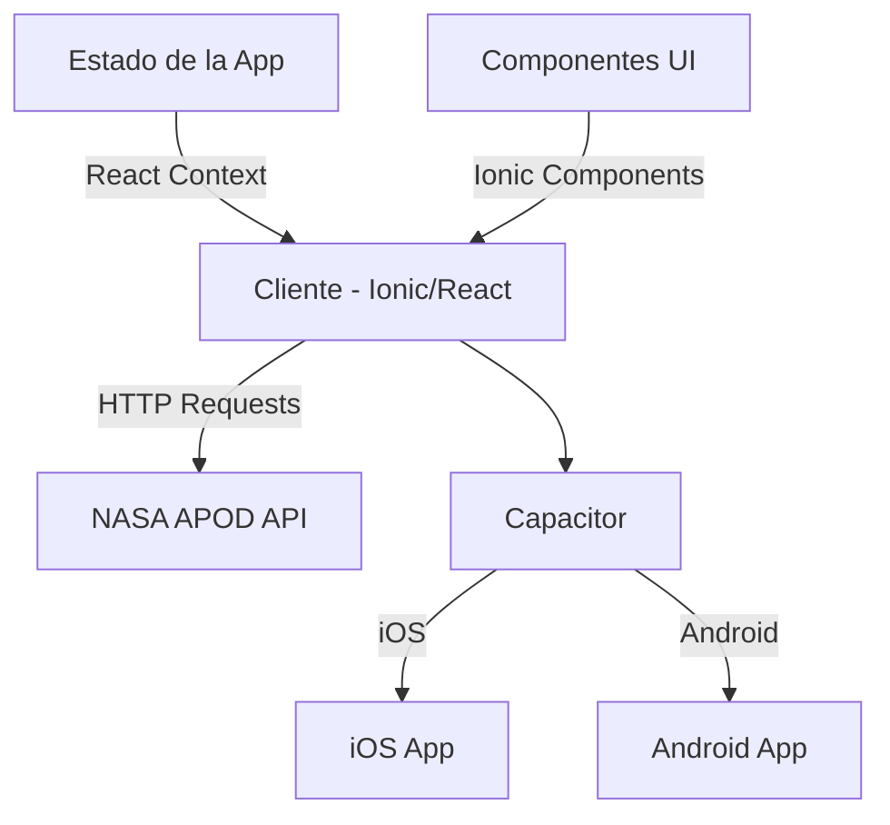
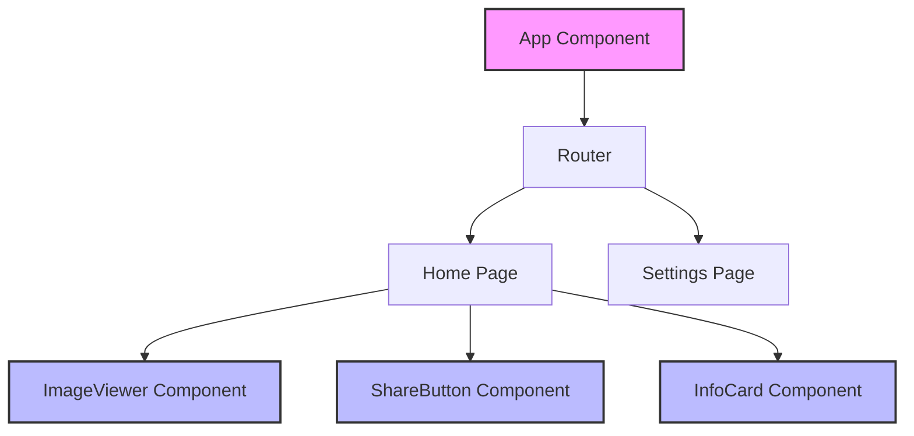
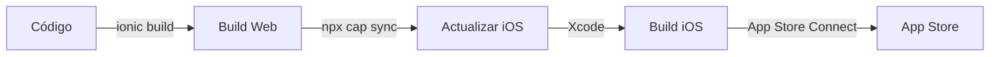
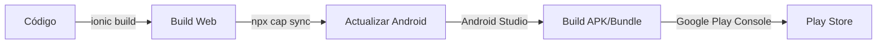

# Documentación NasaTok

## Índice
1. [Descripción General](#descripción-general)
2. [Arquitectura](#arquitectura)
3. [Tecnologías](#tecnologías)
4. [Estructura del Proyecto](#estructura-del-proyecto)
5. [Configuración del Entorno](#configuración-del-entorno)
6. [Guía de Desarrollo](#guía-de-desarrollo)
7. [Despliegue](#despliegue)

## Descripción General
NasaTok es una aplicación móvil inspirada en la interfaz de TikTok que muestra la Imagen Astronómica del Día (APOD) de la NASA. La aplicación proporciona una experiencia inmersiva para explorar imágenes espaciales fascinantes a través de una interfaz familiar y moderna.

## Arquitectura



## Diagrama de Componentes



## Tecnologías
- **Frontend Framework**: React 18.2.0 con TypeScript
- **UI Framework**: Ionic React 8.0.0
- **Routing**: React Router 5.3.4
- **Mobile**: Capacitor 7.0.1
- **Testing**: 
  - Cypress para E2E
  - Vitest para pruebas unitarias
- **Estilizado**: TailwindCSS 4.0.3
- **Build Tool**: Vite 5.2.0

## Estructura del Proyecto
```
nasatok/
├── src/               # Código fuente
├── public/            # Archivos estáticos
├── ios/               # Configuración específica de iOS
├── android/           # Configuración específica de Android
├── cypress/           # Pruebas E2E
└── capacitor.config.ts # Configuración de Capacitor
```

## Configuración del Entorno

### Requisitos Previos
- Node.js (versión recomendada: >=16)
- npm o yarn
- Xcode (para desarrollo iOS)
- Android Studio (para desarrollo Android)
- Ionic CLI

### Instalación
1. Clonar el repositorio:
   ```bash
   git clone https://github.com/AlejandroJBArellano/nasatok.git
   cd nasatok
   ```

2. Instalar dependencias:
   ```bash
   npm install
   ```

3. Configurar variables de entorno:
   - Crear archivo `.env` basado en `.env.example`
   - Añadir tu API key de NASA

### Comandos Principales
- `npm run dev`: Inicia el servidor de desarrollo
- `npm run build`: Construye la aplicación para producción
- `npm run test.e2e`: Ejecuta pruebas E2E
- `npm run test.unit`: Ejecuta pruebas unitarias

## Guía de Desarrollo

### Flujo de Trabajo
1. Crear una nueva rama para cada feature
2. Seguir las guías de estilo de código (ESLint + Prettier)
3. Escribir pruebas para nuevas funcionalidades
4. Crear PR para revisión de código

### Mejores Prácticas
- Utilizar componentes funcionales y hooks
- Implementar lazy loading para optimización
- Seguir principios de diseño responsivo
- Mantener la accesibilidad como prioridad

## Despliegue

### iOS


### Android


## Contribución
Las contribuciones son bienvenidas. Por favor, lee nuestras guías de contribución antes de enviar un PR.

## Licencia
Este proyecto está bajo la licencia MIT. Ver el archivo `LICENSE` para más detalles.

## Contacto
- Desarrollador: [ArellanoDev](https://bento.me/arellanodev)
- GitHub: [Repositorio del Proyecto](https://github.com/AlejandroJBArellano/nasatok) 